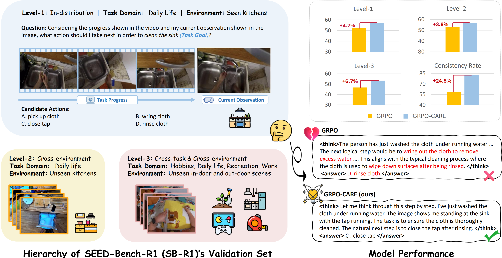
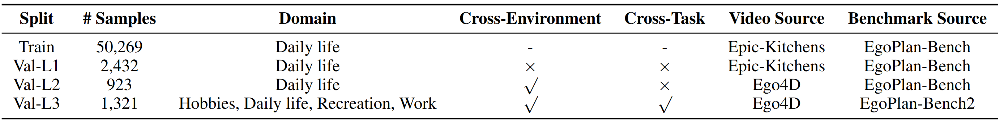

<div align="center">
<h1>
GRPO-CARE: Consistency-Aware Reinforcement Learning for Multimodal Reasoning

<a href='https://arxiv.org/pdf/2503.24376'></a> 
<a href='https://huggingface.co/datasets/TencentARC/SEED-Bench-R1'></a>
<a href='https://huggingface.co/datasets/TencentARC/SEED-Bench-R1'></a>
</h1>


<p align="center">
  
</p>

</div>

## 🚀Introduction

Recent reinforcement learning (RL) approaches, such as outcome-supervised GRPO, have advanced Chain-of-Thought reasoning in large language models (LLMs), yet their adaptation to multimodal LLMs (MLLMs) remains unexplored. 
To address the lack of rigorous evaluation for MLLM post-training methods—especially on tasks requiring balanced perception and reasoning—we present **SEED-Bench-R1**, a benchmark featuring complex real-world videos that demand intricate visual understanding and commonsense planning. SEED-Bench-R1 uniquely provides a large-scale training set and evaluates generalization across three escalating challenges: in-distribution, cross-environment, and cross-environment-task scenarios.
Using SEED-Bench-R1, we identify a key limitation of standard outcome-supervised GRPO: while it improves answer accuracy, it often degrades the logical coherence between reasoning steps and final answers, achieving only a 57.9\% consistency rate. We attribute this to (1) reward signals focused solely on final answers, which encourage shortcut solutions at the expense of reasoning quality, and (2) strict KL divergence penalties, which overly constrain model exploration and hinder adaptive reasoning.

To overcome these issues, we propose **GRPO-CARE**, a novel consistency-aware RL framework that jointly optimizes for both answer correctness and reasoning coherence, without requiring explicit process supervision. GRPO-CARE introduces a two-tiered reward: (1) a base reward for answer correctness, and (2) an adaptive consistency bonus, computed by comparing the model’s reasoning-to-answer likelihood (via a slowly-evolving reference model) against group peers. This dual mechanism amplifies rewards for reasoning paths that are both correct and logically consistent.
By replacing the KL penalty with an adaptive, group-relative consistency bonus, GRPO-CARE consistently outperforms standard GRPO on SEED-Bench-R1, achieving a 6.7\% performance gain on the most challenging evaluation level and a 24.5\% improvement in consistency rate. Furthermore, GRPO-CARE demonstrates strong transferability, improving model performance across diverse video understanding benchmarks.
Our work contributes a systematically designed benchmark and a generalizable post-training framework, advancing the development of more interpretable and robust MLLMs.

## 🚩News
- [2025/06/18] We release the training code for GRPO-CARE💥
- [2025/03/31] We release the datasets of [SEED-Bench-R1](https://github.com/TencentARC/SEED-Bench-R1/) and the training / evaluation codes.

## 📝Data

SEED-Bench-R1 consists of a large-scale training set and a hierarchical three-level validation set for in-distribution, cross-environment, and cross-environment-task evaluations. The datasets can be downloaded from [HuggingFace](https://huggingface.co/datasets/TencentARC/SEED-Bench-R1). 

Specifically, SEED-Bench-R1 is built on our prior works, reusing the training and validation data from our [EgoPlan-Bench](https://github.com/ChenYi99/EgoPlan), as well as the test data from our [EgoPlan-Bench2](https://github.com/qiulu66/EgoPlan-Bench2). The validation data from EgoPlan-Bench are used for Level-1 (in-distribution) and Level-2 (OOD, cross-environment) evaluation, while the test data from EgoPlan-Bench2 cover more general domains and are used for Level-3 (OOD, cross-environment-task) evaluation.

<p align="center">
  
</p>

Questions from the human-verified validation data are formatted as multiple-choice problems. MLLMs need to select the most reasonable answer from four candidate choices. The primary metric is Accuracy. 

<p align="center">
  
</p>


## 🔥Training Models

> [!NOTE] The training commands below are configured for a node of 4 x 80GPUs. For different hardware and topologies, you may need to tune the batch size and number of gradient accumulation steps.

### Set Up
```
git clone https://github.com/TencentARC/GRPO-CARE.git
cd GRPO-CARE

# build environment
conda create -n grpo-care python=3.11 
conda activate grpo-care
bash setup.sh

# download SEED-Bench-R1 data
git lfs install
git clone https://huggingface.co/datasets/TencentARC/SEED-Bench-R1

# download the model checkpoint of Qwen2.5-VL-7B-Instruct
git clone https://huggingface.co/Qwen/Qwen2.5-VL-7B-Instruct

# download Video-R1 data [optional for training or evaluation on general video understanding benchmarks]
cd ./src/r1-v/
git clone https://huggingface.co/datasets/Video-R1/Video-R1-data
python ./src/unzip.py
```

### Training on SEED-Bench-R1 Data

For evaluation on SEED-Bench-R1, please use [run_grpo_care_margin0_seed_bench_r1.sh](scripts/run_grpo_care_margin0_seed_bench_r1.sh).

For evaluation on general video understanding benchmarks, please use [run_grpo_care_margin0.01_seed_bench_r1.sh](scripts/run_grpo_care_margin0.01_seed_bench_r1.sh)

> We found that training the model on SEED-Bench-R1 data using GRPO-CARE with a consistency_margin of 0.01 improves its performance on general video understanding benchmarks, while setting the consistency_margin to 0 yields better results on SEED-Bench-R1 itself.

### Training on General-Domain Data ([Video-R1-260k](https://huggingface.co/datasets/Video-R1/Video-R1-data/blob/main/Video-R1-260k.json))

Please refer to [run_grpo_care_margin0.01_video_r1.sh](scripts/run_grpo_care_margin0.01_video_r1.sh).


## 🤖Evaluating Models

### Evaluation on SEED-Bench-R1

```
export CUDA_VISIBLE_DEVICES=0
export PROJECT_ROOT=[your path to grpo-care root]
conda activate grpo-care
cd ${PROJECT_ROOT}
nohup bash scripts/eval_general_video_bench.sh > scripts/eval_general_video_bench.log 2>&1 &
tail -f scripts/eval_general_video_bench.log
```


### Evaluation on General Video Understanding Benchmarks

```
export CUDA_VISIBLE_DEVICES=0
export PROJECT_ROOT=[your path to grpo-care root]
conda activate grpo-care
cd ${PROJECT_ROOT}
nohup bash scripts/eval_general_video_bench.sh > scripts/eval_general_video_bench.log 2>&1 &
tail -f scripts/eval_general_video_bench.log
```

## 🙌References & Acknowledgements
We sincerely thank the contributions from the open source community. The related projects are as follows:
- [SEED-Bench-R1](https://github.com/TencentARC/SEED-Bench-R1)
- [Video-R1](https://github.com/tulerfeng/Video-R1)
- [Open-R1-Video](https://github.com/Wang-Xiaodong1899/Open-R1-Video)
- [EgoPlan](https://github.com/ChenYi99/EgoPlan)
- [EgoPlan-Bench2](https://github.com/qiulu66/EgoPlan-Bench2)
- [open-r1-multimodal](https://github.com/EvolvingLMMs-Lab/open-r1-multimodal)
- [lmm-r1](https://github.com/TideDra/lmm-r1)
- [DeepSeek](https://github.com/deepseek-ai/DeepSeek-R1) 
- [Open-R1](https://github.com/huggingface/open-r1)
- [OpenRLHF](https://github.com/OpenRLHF/OpenRLHF)

## ⭐License
The video samples in SEED-Bench-R1 are collected from [Epic-Kitchens](https://epic-kitchens.github.io/2025) and [Ego4D](https://ego4d-data.org/). Users must follow the related licenses ([Epic-Kitchens](https://creativecommons.org/licenses/by-nc/4.0/) and [Ego4D](https://ego4ddataset.com/ego4d-license/)) to use these video samples for training and validation. SEED-Bench-R1 does not hold the copyright for these videos and the copyright belongs to the original owner of these datasets.


## 📚Citation
If you find our project helpful, hope you can star our repository and cite our paper as follows:

```bibtex
@article{chen2025exploring,
  title={Exploring the Effect of Reinforcement Learning on Video Understanding: Insights from SEED-Bench-R1},
  author={Chen, Yi and Ge, Yuying and Wang, Rui and Ge, Yixiao and Qiu, Lu and Shan, Ying and Liu, Xihui},
  journal={arXiv preprint arXiv:2503.24376},
  year={2025}
}
```
